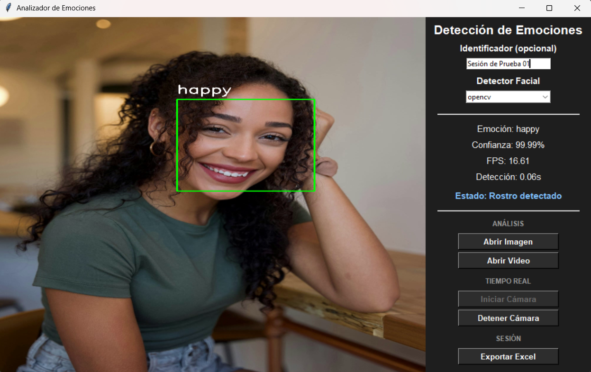
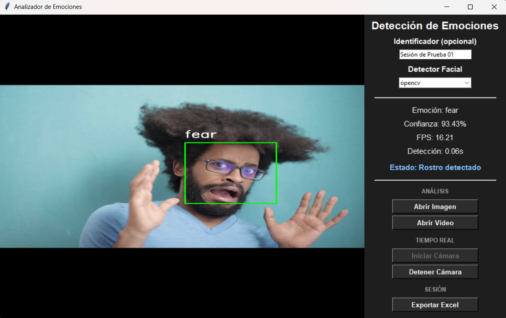
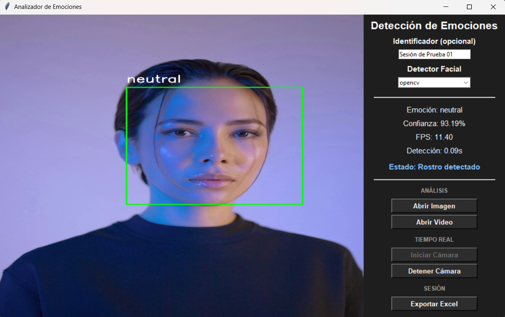
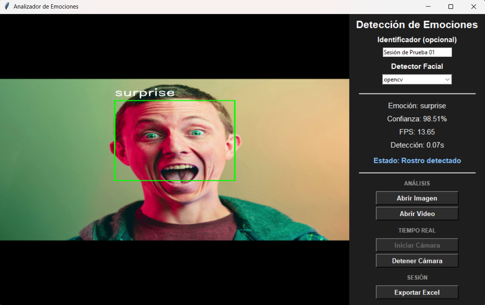
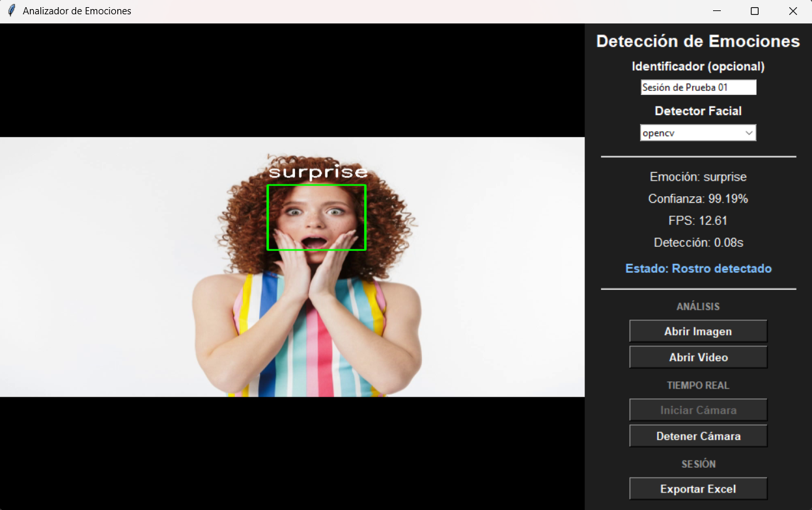

# Real-Time Emotion Analysis

Desktop application for facial emotion recognition using DeepFace and OpenCV.

The system supports image, video, and camera-based analysis while providing live performance metrics, detector comparisons, and Excel export capabilities for experimental evaluation.

Originally developed as part of research activities conducted at UABCS's Artificial Intelligence and Robotics Research Laboratory (LIDIAIR).

---

## Features

- Real-time emotion recognition
- Support for webcam, image, and video analysis
- Multiple facial detectors
- Performance metrics (FPS and inference time)
- Session statistics tracking
- Excel export functionality
- Comparative evaluation of detector responsiveness
- Detection history logging
- Experimental benchmarking across different hardware configurations

---

## Tech Stack

- Python
- OpenCV
- DeepFace
- TensorFlow
- Pandas
- Tkinter

---

## Screenshots

The screenshots below showcase the emotion recognition interface operating under different evaluation scenarios.

| Happy | Fear | Neutral |
|---|---|---|
|  |  |  |

| Surprise | Alternative Scenario |
|---|---|
|  |  |

---

## Experimental Context

This project was developed as part of research activities at the Artificial Intelligence and Robotics Research Laboratory (LIDIAIR) at UABCS.

The primary objective was to explore the practical viability of real-time facial emotion recognition systems while evaluating trade-offs between detector accuracy, inference speed, and overall responsiveness.

Rather than focusing exclusively on prediction quality, the project also incorporated performance measurements and exportable metrics to support experimental analysis.

---

## Notes

The repository represents an ongoing research-oriented prototype.

Although the system supports live webcam processing, the screenshots included in this README use controlled evaluation scenarios to provide reproducible examples of the application's interface and outputs.

Additional detectors, evaluation strategies, and reporting capabilities may continue to evolve over future iterations of the project.
